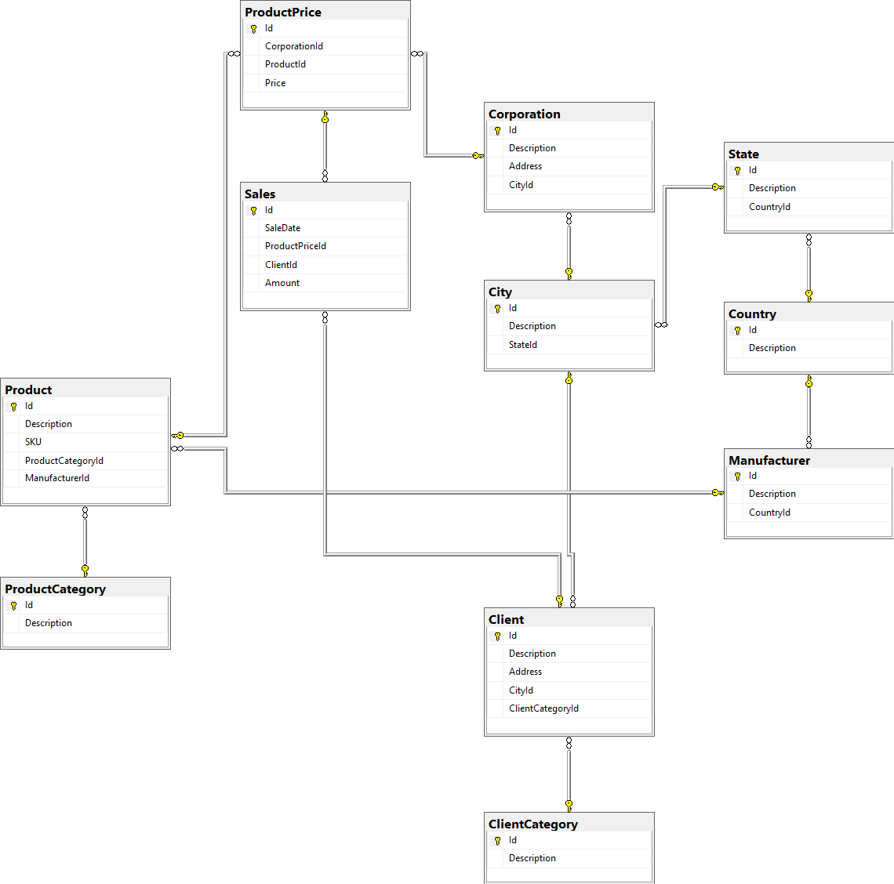
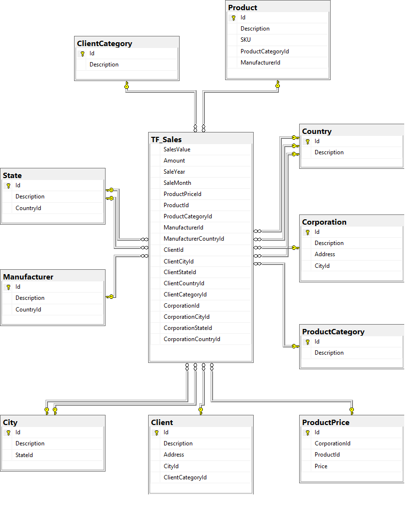
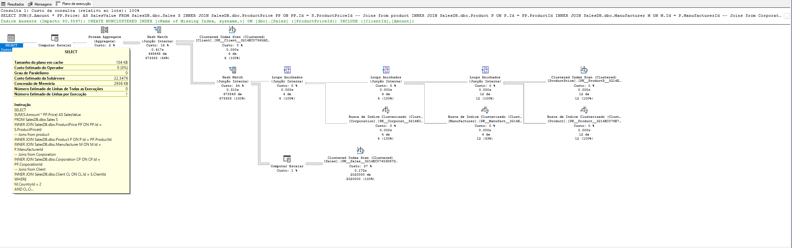
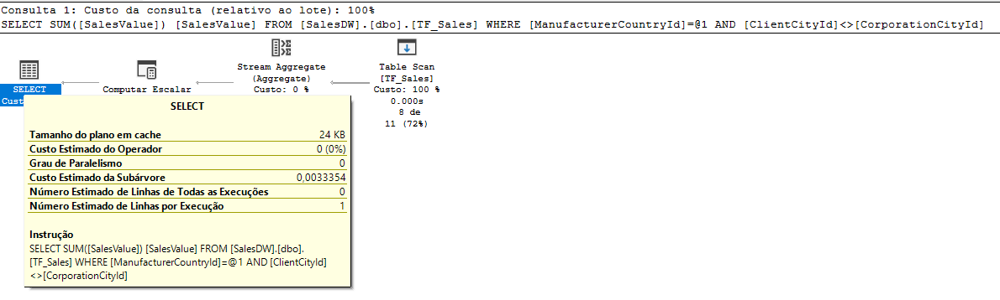

# sample-olap
Exemplo de modelagem OLAP apresentada como trabalho na disciplina de Modelagem de Dados do curso de Mestrado em Ciência da Computação da Universidade Federal de Uberlândia.

- Scripts desenvolvidos para uso com o SGBD: Sql Server;
- Necessário datatabase SalesDB;
- Necessário database SalesDW;
- Análise dos planos de execução e geração dos diagramas ER pelo Sql Server Management Studio (SSMS).

## Modelagem de Banco de Dados Relacional - Modelo OLTP



## Modelo Star - OLAP



## Problema para comparação

Calcular o total de vendas de produtos chineses nas situações onde o clientes é de outro domicílio. Exemplo: O cliente com domicílio na cidade A, faz uma compra de produtos chineses na cidade B. 

### Resolvendo o problema na modelagem OLTP 

O primeiro ponto a ser notado é a complexidade da consulta. Como o precisamos saber a nacionalidade do fabricante, a cidade do cliente e a cidade da empresa, precisamos assim de algumas junções para chegar nessas informações.
Se pensarmos em adicionar a descrição do país do produto, estado e cidade tanto do cliente quanto da empresa, a complexidade seria ainda maior, pos teriamos que navegar entre os relacionamentos. 
Nota: Quer entender melhor a complexidade? Faça uma consulta que traga essas informações no agrupamento e compare o plano de execução.

```{sql}
SELECT 
	SUM(S.Amount * PP.Price) AS SalesValue
FROM SalesDB.dbo.Sales S
INNER JOIN SalesDB.dbo.ProductPrice PP ON PP.Id = S.ProductPriceId
-- Joins from product
INNER JOIN SalesDB.dbo.Product P ON P.Id = PP.ProductId
INNER JOIN SalesDB.dbo.Manufacturer M ON M.Id = P.ManufacturerId
-- Joins from Corporation
INNER JOIN SalesDB.dbo.Corporation CP ON CP.Id = PP.CorporationId
-- Joins from Client
INNER JOIN SalesDB.dbo.Client CL ON CL.Id = S.ClientId
WHERE
	M.CountryId = 2
	AND CL.CityId <> CP.CityId
```

Agora analisemos o plano de execução:



* O primeiro ponto que fica evidente, é o tamanho do plano de execução. Ele demonstra passo a passo como o banco de dados resolveu a sua consulta. De maneira geral, planos de execução mais simples tendem a ser mais performáticos. 
* Um ponto importante de se analisar são os índices ausentes. O SQL Server Management Studio já sugere indices ausentes para suas consultas, como forma de melhorar a performance. Porém, cada índice de leitura criado, impacta a escrita e cada consulta pode sugerir índices diferentes para serem otimizadas.
* O custo da sub-árvore, que é o custo de todos os nós filhos, na imagem é de 22,3476 pontos.

### Resolvendo o problema na modelagem OLAP

Ao analisar a consulta feita na base OLAP para resolver o mesmo problema, percebe-se a vantagem da modelagem. Ao trazer as chaves das dimensões para a tabela de fatos, eliminamos a necessidade de junções com outras tabelas. 
Se pensarmos em adicionar a descrição do país do produto, estado e cidade tanto do cliente quanto da empresa, a complexidade seria menor do que o OLAP já que não seria necessário navegar entre os relacionamentos, já que poderíamos fazer a junção diretamente nas tabelas das dimensões desejadas.

```{sql}
SELECT
	SUM(SalesValue) AS SalesValue
FROM SalesDW.dbo.TF_Sales
WHERE ManufacturerCountryId = 2
	AND ClientCityId <> CorporationCityId 
```

Agora analisemos o plano de execução:



* O plano de execução é extremamente simples, apenas uma busca pelos critérios de busca e agregação dos valores.
* A consulta é tão performática, que não são necessários novos índices para otimização.
* O custo da sub-árvore, que é o custo de todos os nós filhos, na imagem é de 0,0033354 pontos.
