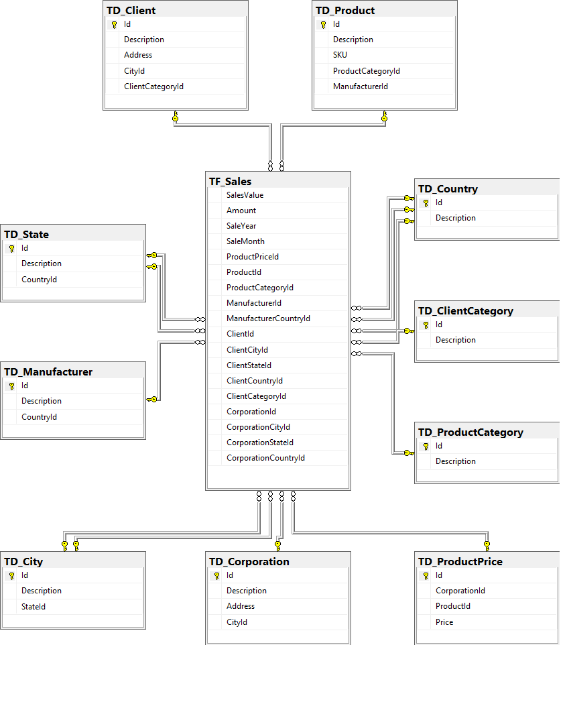

# sample-olap
Exemplo de modelagem OLAP apresentada como trabalho na disciplina de Modelagem de Dados do curso de Mestrado em Ciência da Computação da Universidade Federal de Uberlândia.

- Scripts desenvolvidos para uso com o SGBD: Sql Server
- Criar datatabase SalesDB
- Criar database SalesDW

## Modelo OLTP

## Modelo OLAP

